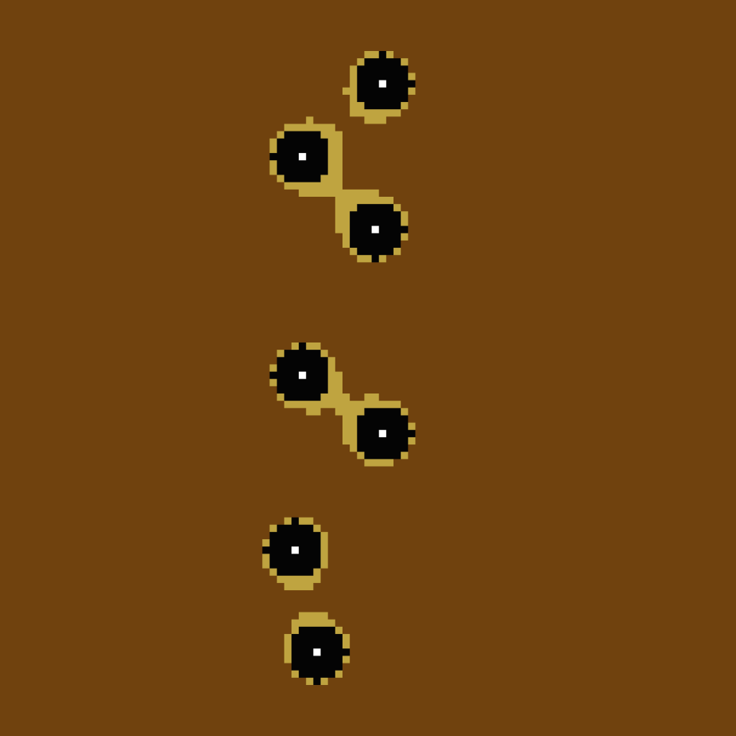

# butterfly eyespot

> [Modelling](#some-results) butterfly wing eyespot patterns


This is a monorepo containing :

- a python package for modelling eyespot patterns
- a jupyter notebook explaining the model with some results
- a svelte app for visualising the results

## Usage

firstly install the project dependencies with [poetry](https://python-poetry.org/)

```bash
poetry install
```

### Python package

It's a class that can be used to generate numerical solutions to the eyespot pattern problem. It can be used as follows:

```python
from src.model import Model

model = Model()
model.sync_focis([
	(50, 49), (50, 50), (50, 51),
])
model.solve()

# plot the solution
model.show()
```

### Jupyter notebook

Everything you need is in the [notebook](./main.ipynb).

### Svelte app

You need to build the app first, see [webapp readme](./webapp/README.md).
Then you can run the api server (it will serve the app and the api):

```bash
python app.py
```

## License

This project is under [MIT](./license) license.

## Some results
<div style="display: flex;flex-wrap: wrap;">
	
	
    
	
</div>